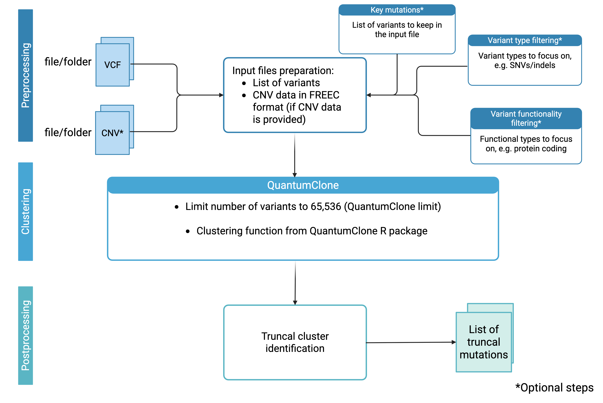

# **TruncalFlow - Pipeline for Truncal Mutations Identification** 

## **Overview**
TruncalFlow is a high-throughput command-line tool for identifying truncal mutations from tumor sequencing data. Built around the [QuantumClone](https://pmc.ncbi.nlm.nih.gov/articles/PMC5972665/) R package for clonal reconstruction, it streamlines preprocessing, formatting, clustering, and postprocessing steps into a single automated pipeline optimized for use on HPC environments.

<p align="center">
  
</p>


ℹ️ This tool wraps and extends QuantumClone. Please cite Deveau et al., 2018 if using this workflow in your research.

---

## **Input Files**

| Required | Argument            | Description                                                      |
|----------|---------------------|------------------------------------------------------------------|
| ✅       | `--vcf`        | Single VCF file or directory containing one VCF per sample      |
| ❌       | `--cnv`        | CNV file or directory (optional, but recommended)               |
| ➕       | `--cnv_format` | Format of CNV data. Required if `--cnv` is provided. Accepted values: `battenberg` or `major_minor_format` |
| ❌       | `--key_mutations`   | List of mutation identifiers to retain regardless of filters in format CHROM POS REF ALT |


- After preprocessing, from the VCF file a `*_SNVlist.txt` file is created for each sample.
- If CNV data is provided, a `*_freec.txt` file is generated, formatted for QuantumClone clustering.
- These files serve as the direct inputs to the clustering step.

---

## **Installation**

This tool can be installed by cloning this repository:

```
git clone https://github.com/mmasliakova/TruncalFlow.git
cd TruncalFlow/scripts
```

### **Dependencies**

TruncalFlow runs inside a containerized R environment built with Singularity (Apptainer). To install dependencies:

```
singularity pull docker://stevelefever/thesis_2025_marina
```

The resulting .sif file (thesis_2025_marina_latest.sif) should be placed in the same directory as main.py.

---

## **Running Instructions**

This tool must be run on an HPC system with PBS job scheduler support.

Basic usage:

```
python3 main.py \
  --vcf /path/to/vcf(s)/ \
  --output_dir /path/to/output/
```

Full example with CNV and optional arguments:

```
python3 main.py \
  --vcf ./vcf_dir/ \
  --cnv ./cnv_dir/ \
  --cnv_format battenberg \
  --output_dir ./results/ \
  --mutation_types snv \
  --functional_filter missense stop_gained \
  --filtering_mode both \
  --key_mutations key_mutations.txt \
  --time 03:00:00
```

ℹ️ For more details about the mutations clustering step, check out the [QuantumClone GitHub repository](https://github.com/DeveauP/QuantumClone).

---

## **Arguments**

The pipeline executor main_wrapper.py takes the following options:

| Argument             | Required            | Description                                                                                                  |
|----------------------|---------------------|--------------------------------------------------------------------------------------------------------------|
| `--vcf`              | ✅                  | Input VCF file or folder containing one VCF per sample                                                       |
| `--cnv`              | ❌                  | Optional CNV file or directory                                              |
| `--cnv_format`       | ✅ if `--cnv` is set | Format of CNV data. Accepted values: `battenberg` or `major_minor_format`         |
| `--output_dir`       | ✅                  | Directory where output results will be saved                               |
| `--mutation_types`   | ❌                  | Filter for mutation types: snv, indel                                |
| `--functional_filter`| ❌                  | Filter for functional consequence: comma-separated list (e.g., `missense`, `stop_gained`)   |
| `--filtering_mode`   | ❌                  | Combine mutation_types and functional_filter using `both` (both must match) or `single` (default)  |
| `--key_mutations`    | ❌                  | Path to a file listing important mutation IDs to retain regardless of filters (e.g., `key_mutations.txt` |
| `--time`             | ❌                  | Walltime for clustering jobs (default: `10:00:00`), increase if a clustering job failed due to runtime issue  |

---

## **Output**

A folder is created for each sample under the specified `--output_dir`. Inside each folder:

```
sample_X/
│
├── QuantumClone output files
├── truncalmutations.txt # Final truncal mutation list
└── pbs_jobs/ # PBS job logs and scripts
```

The file `truncalmutations.txt` includes a table of mutations assigned to the truncal cluster:

| Chromosome | Position  | Depth | Alt | Cellularity | Genotype | NC | NCh | id | Sample | Cluster | MutationType |
|------------|-----------|-----|-----|---------|-------------|----|----|-----|---------------|----|---------|
| 3       | 16153608  | 124   | 40   | 0.645161290322581       | AB        | 1   | 2    | 240   | P3-noXY  |  1 | SNV   |

- **Chromosome**: Chromosomal location of the mutation
- **Position**: Genomic coordinate
- **Depth**: Total number of reads covering the mutation site
- **Alt**: Number of reads supporting the alternate allele
- **Cellularity**: Estimated proportion of cancer cells harboring the mutation
- **Genotype**: Observed genotype at the locus (e.g., AB)
- **NC**: Total copy number at the locus
- **NCh**: Number of chromosomal copies harboring the mutation
- **id**: Unique mutation identifier (position in input list)
- **Sample**: Sample name
- **Cluster**: QuantumClone cluster assignment (all mutations in the list have the same cluster ID - truncal cluster)
- **MutationType**: Type of variant (e.g., SNV or indel)


## **Notes**

If you wish to re-run the clustering step for certain samples, where clustering was finished, you'll need to delete the clustering results for this sample first. This is done to protect against overwriting the results in case multiple samples (in one folder) are used. 
